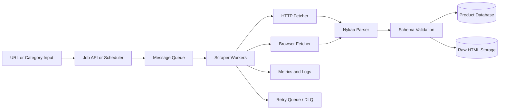
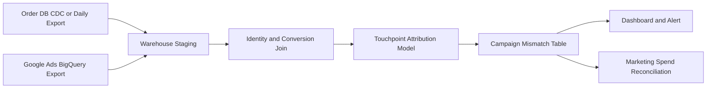

# Nykaa Product Data Pipeline

A small, production-minded prototype for extracting product attributes such as MRP, selling price, size, rating, and review count from Nykaa product pages.

The code is intentionally a proof of concept. The important design decision is the separation between fetching, parsing, orchestration, and persistence so that the prototype can evolve into a queue-backed scraping service.

## What It Demonstrates

- Structured product records with explicit error fields
- HTTP fetching with retries and exponential backoff
- Browser fallback for JavaScript-rendered or HTTP-blocked pages
- Parser independent of the fetch mechanism
- Batch URL input and parallel workers
- CSV export for analysis and downstream ingestion

## Quick Start

```powershell
python -m venv .venv
.venv\Scripts\Activate.ps1
python -m pip install -r requirements.txt
python -m playwright install chromium
```

Run one product:

```powershell
python scraper.py --url "https://www.nykaa.com/<product-path>" --output nykaa_products.csv
```

Run multiple products:

```powershell
python scraper.py --url "https://www.nykaa.com/product-1" --url "https://www.nykaa.com/product-2" --workers 4
```

Or create `urls.txt` with one URL per line and run:

```powershell
python scraper.py --input urls.txt --workers 4 --output nykaa_products.csv
```

The output contains `product_url`, `product_name`, `mrp`, `selling_price`, `size`, `rating`, `review_count`, `scraped_at`, and `error`.

## Architecture Approach



### Prototype boundaries

The current `scraper.py` keeps the first implementation easy to run locally, but preserves the following boundaries:

- **Fetcher:** obtains HTML using HTTP first and browser rendering as fallback.
- **Parser:** converts HTML into a `ProductRecord`; it does not know how the page was fetched.
- **Orchestrator:** accepts one or many URLs and manages worker concurrency.
- **Persistence:** currently CSV; production storage should be introduced behind a repository interface.

### Production execution flow

1. An API or scheduler creates a scrape job for each URL.
2. Jobs are published to a queue such as SQS, RabbitMQ, or Redis Queue.
3. Stateless workers consume jobs and apply a per-domain rate limit.
4. The worker first uses the HTTP fetcher because it is cheaper and faster.
5. A `403`, JavaScript-only page, or incomplete document routes the job to a browser worker.
6. The parser extracts JSON-LD first, then embedded application state, stable DOM selectors, and finally narrowly scoped fallbacks.
7. A validator checks types, required fields, price relationships, and freshness.
8. Normalized records go to PostgreSQL; raw HTML and parser metadata go to object storage.
9. Transient failures are retried with backoff. Permanent failures go to a dead-letter queue.
10. Metrics and structured logs provide success rate, latency, block rate, extraction completeness, and retry volume.

## Making It Scalable

### Queue-based workers

Do not make a web request wait for scraping to finish. A queue decouples ingestion from execution and allows workers to scale horizontally. Job records should include a stable `job_id`, URL, source, priority, attempt count, status, and timestamps.

### Fetching strategy

Use separate worker pools for HTTP and browser work. Browser contexts are expensive, so reuse a bounded browser pool rather than launching a browser for every URL. Apply timeouts, exponential backoff, circuit breakers, and a per-domain concurrency limit.

Nykaa may return `403` or behave differently for automated HTTP clients. The system should treat that as a routing signal, not as a parser failure. Browser rendering should remain a controlled fallback and must follow the website's terms, robots rules, and applicable law.

### Idempotency and caching

Use the canonical product URL or product ID as an idempotency key. Store fetch time, content hash, parser version, and source status. Avoid re-fetching unchanged products unless a scheduled refresh requires it.

### Storage

- **PostgreSQL:** normalized product records and job state
- **Object storage:** raw HTML, screenshots, and parser evidence for audits
- **Warehouse:** historical price and rating analysis
- **CSV:** local development and small exports only

### Observability

Track:

- Queue depth and oldest job age
- HTTP success, `403`, timeout, and browser fallback rates
- Average and percentile scrape duration
- Field-level extraction completeness
- Retry and dead-letter counts
- Parser version and schema failures

Alert on sustained block rates, falling extraction completeness, and queue growth.

## Suggested Production Layout

```text
src/
  fetchers/http.py
  fetchers/browser.py
  parsers/nykaa.py
  models/product.py
  workers/product_worker.py
  storage/products.py
  storage/raw_pages.py
  jobs/queue.py
  observability/metrics.py
```

The parser should be tested with saved HTML fixtures. Contract tests should verify that a schema change or Nykaa layout change cannot silently produce blank prices or ratings.

## Limitations of This Prototype

- CSV is not transactional storage.
- The local command does not include a queue or scheduler.
- Browser fallback depends on the local network and browser runtime.
- Website layouts and anti-automation controls can change.
- No proxy rotation, CAPTCHA solving, or bypass mechanism is included.

## Responsible Operation

Only collect data that is permitted by the source website's terms, robots policy, and applicable legal requirements. Keep request rates low, cache results, identify the client where appropriate, and stop when the source indicates that automated access is not allowed.

## Google Ads Attribution Reconciliation

`attribution.py` compares the campaign stored by the order system with the campaign selected from a customer's Google Ads touchpoint journey. It is deliberately separate from the Nykaa scraper because attribution is a warehouse reconciliation problem, not a page-fetching problem.

### Input contract

The order system export must contain:

```text
order_id,order_campaign_id
```

The BigQuery journey export must contain one row per touchpoint:

```text
order_id,campaign_id,touchpoint_time
```

The production query should join Google Ads touchpoints to orders using a governed conversion ID, click ID, or analytics user/session mapping. Do not join on email or other raw personal data unless the data-processing agreement explicitly permits it.

### Run locally with sample data

```powershell
python attribution.py `
  --orders examples/orders.csv `
  --touchpoints examples/google_ads_touchpoints.csv `
  --rule last_click `
  --output attribution_mismatches.csv
```

The default `last_click` rule compares the order-system campaign with the final Google Ads campaign before conversion. Use `--rule first_click` when that is the agreed business definition. Every mismatch retains touchpoint count, first campaign, last campaign, and conversion time so the result is auditable.

### BigQuery production query shape

The exact Google Ads transfer schema varies by account and export configuration. Keep the source-specific SQL in a versioned query file and normalize it to the input contract above:

```sql
SELECT
  conversion.order_id,
  ads.campaign_id,
  ads.touchpoint_time
FROM `project.google_ads.touchpoints` AS ads
JOIN `project.analytics.conversions` AS conversion
  ON conversion.gclid = ads.gclid
WHERE ads.touchpoint_time <= conversion.conversion_time
```

Then load the result with `read_bigquery(project, query)` and pass it to `find_mismatches(orders, touchpoints, rule)`. In production, write the normalized result to a partitioned BigQuery table rather than CSV.

### Scalable attribution architecture



For scale, run this as an incremental scheduled query or dbt model partitioned by conversion date. Deduplicate touchpoints by click ID, keep late-arriving events within a reprocessing window, and use a stable `order_id` plus `conversion_date` as the reconciliation key. Add data-quality checks for missing joins, duplicate orders, invalid campaign IDs, timezone drift, and orders with no eligible touchpoint.
